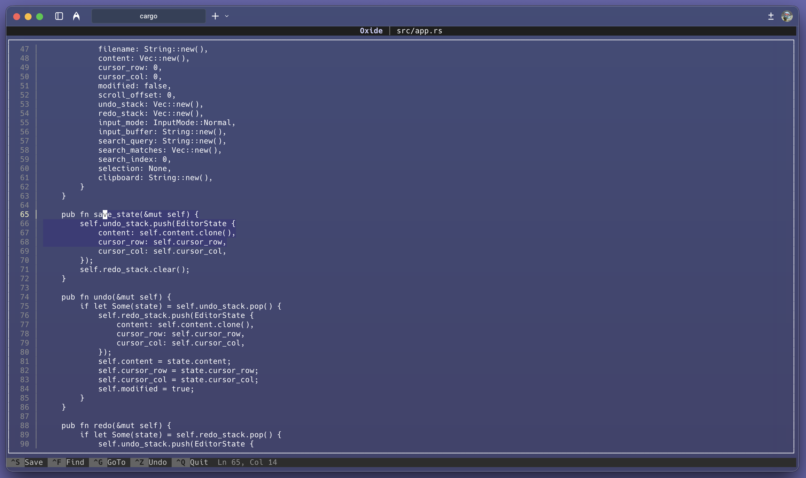

# Oxide

A lightweight terminal text editor written in Rust.

## Features

- **Full text editing** — Insert, delete, backspace, enter, tab (4 spaces)
- **Navigation** — Arrow keys, Home/End, Page Up/Down, Ctrl+G go to line
- **Search** — Ctrl+F with ↑/↓ to cycle through matches
- **Selection** — Shift+arrows, Ctrl+A select all
- **Clipboard** — Ctrl+C copy, Ctrl+X cut, Ctrl+V paste
- **Undo/Redo** — Ctrl+Z / Ctrl+Y with full history
- **Mouse support** — Click to position cursor
- **File handling** — Auto-create new files, unsaved changes warning
- **Visual feedback** — Line numbers, cursor highlighting, modified indicator

## Keyboard Shortcuts

| Key | Action |
|-----|--------|
| Ctrl+S | Save |
| Ctrl+Q | Quit |
| Ctrl+F | Find |
| Ctrl+G | Go to line |
| Ctrl+Z | Undo |
| Ctrl+Y | Redo |
| Ctrl+C | Copy |
| Ctrl+X | Cut |
| Ctrl+V | Paste |
| Ctrl+A | Select all |
| Shift+Arrows | Select text |
| Tab | Insert 4 spaces |
| Esc | Clear selection / Cancel |

## Built With

- [Rust](https://www.rust-lang.org/)
- [ratatui](https://github.com/ratatui-org/ratatui) — Terminal UI framework
- [crossterm](https://github.com/crossterm-rs/crossterm) — Terminal manipulation
- [clap](https://github.com/clap-rs/clap) — Command line argument parsing

